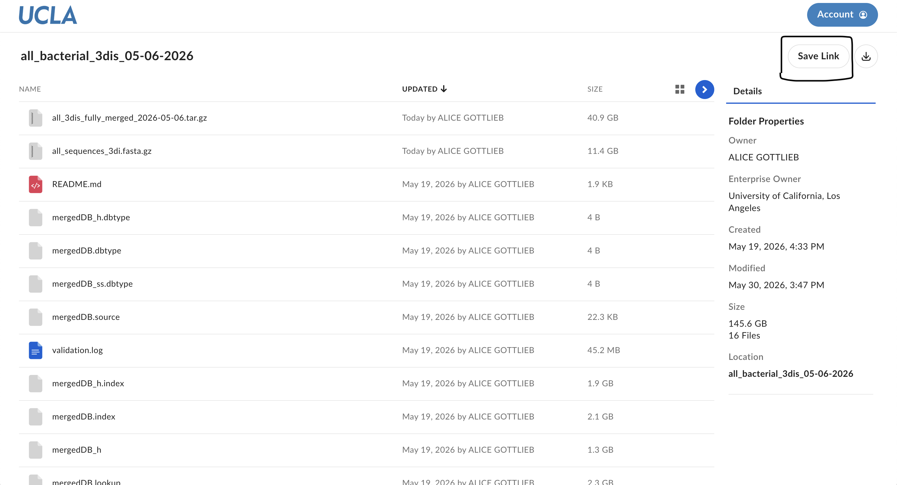

# Rclone Setup and Usage

The easiest way to transfer files from Box and other cloud services to Hoffman is through [rclone](https://rclone.org/). This guide will take you through 1) installing rclone in your user folder on Hoffman, 2) creating a config file on your local machine and copying it to Hoffman, and 3) transferring files, both ones you own and those shared with you.

## 1 - Installing Rclone on Hoffman
# rclone

**rclone** is a command line program to sync files and directories to and from cloud storage - https://rclone.org

## Installing rclone

1. Download and unzip rclone:

   ```bash
   $ wget https://downloads.rclone.org/rclone-current-linux-amd64.zip
   $ unzip rclone-current-linux-amd64.zip
   ```

   2. Move the rclone executable to your `$HOME/bin` directory. If the move fails, you need to create `$HOME/bin` subdirectory, e.g. `mkdir $HOME/bin`:

   ```
   $ mv rclone-*-linux-amd64/rclone $HOME/bin/
   ```

To validate your install, run the following command. Note: if `~/bin` is not in your `$PATH`, you will need to use `~/bin/rclone`.

```
$ ~/bin/rclone --version
```

## 2 - Configuring Rclone
It's easiest to configure rclone on your local computer and then copy that configuration file to Hoffman. If configuring on your local computer and copying to Hoffman fails, follow the directions at https://www.hoffman2.idre.ucla.edu/Using-H2/Data-transfer.html#configuring-rclone with X11 forwarding to configure directly on the server.

1. Download and install rclone on your local computer by downloading the appropriate release from https://rclone.org/downloads/ . 

2. On your local machine, run 
```bash
$ rclone config
```

3. Select `n` for `new remote` and enter a name
```bash
e) Edit existing remote
n) New remote
d) Delete remote
r) Rename remote
c) Copy remote
s) Set configuration password
q) Quit config
e/n/d/r/c/s/q> n
```

```
Enter name for new remote.
name> ucla-box
```

4. From the list, select `box`

```
Storage> box
```

5. Leave `client_id`, `client_secret`, `box_config_file` and `access_token` empty by pressing enter:
```
Option client_id.
OAuth Client Id.
Leave blank normally.
Enter a value. Press Enter to leave empty.
client_id> 

Option client_secret.
OAuth Client Secret.
Leave blank normally.
Enter a value. Press Enter to leave empty.
client_secret> 

Option box_config_file.
Box App config.json location
Leave blank normally.
Leading `~` will be expanded in the file name as will environment variables such as `${RCLONE_CONFIG_DIR}`.
Enter a value. Press Enter to leave empty.
box_config_file> 

Option access_token.
Box App Primary Access Token
Leave blank normally.
Enter a value. Press Enter to leave empty.
access_token>
```

6. Choose `1` for `user`
```
Choose a number from below, or type in your own value of type string.
Press Enter for the default (user).
 1 / Rclone should act on behalf of a user.
   \ (user)
 2 / Rclone should act on behalf of a service account.
   \ (enterprise)
box_sub_type> 1
```

7. Type `n` to allow the default config
```
Edit advanced config?
y) Yes
n) No (default)
y/n> n
```

8. Type `y` to allow web browser config
```
Use web browser to automatically authenticate rclone with remote?
 * Say Y if the machine running rclone has a web browser you can use
 * Say N if running rclone on a (remote) machine without web browser access
If not sure try Y. If Y failed, try N.

y) Yes (default)
n) No
y/n> y
```

9. Wait for your web browser to open and sign in with your UCLA credentials in the browser window

10. Type `y` to accept the setting and save this configuration
```
y) Yes this is OK (default)
e) Edit this remote
d) Delete this remote
y/e/d> y
```

11. Find where your local rclone config file is stored by running
``` 
$ rclone config file
PATH/TO/YOUR/LOCAL/CONFIG/rclone.conf
```

12. Use `scp`, `rsync`, or another method to transfer your local config from `PATH/TO/YOUR/LOCAL/CONFIG/rclone.conf` to `$HOME/.config/rclone/rclone.conf` on Hoffman. You may need to create the directory first with `mkdir -p ~/.config/rclone`.

13. On Hoffman, run
```
$ ~/bin/rclone list remotes
```
Which should show you 
```
ucla-box:
```

## 3 - Transferring Files
Follow the examples at [rclone.org](https://rclone.org) to use `copy`, `sync` and similar commands for one-time or relatively small-file size usage. If you want to use rclone in an interactive session, ssh into Hoffman and then run
```
$ ssh dtn 
```
to access a data-transfer node with faster networking capabilities. 

### qsub Example
For recurring or large scale rclone runs, you can submit a job script with `qsub`. This has the advantage of allowing multiple cores, which is especially useful for transfer with a very large number of files. Follow the example in [rclone-backup.sh](rclone-backup.sh), which copies the entire scratch directory to a timestamped scratch backup folder in Box.

Example `rclone-backup.sh`:

```bash
#!/bin/bash
# Description: Backing up $SCRATCH to UCLA Box with rclone.
#$ -cwd
#$ -o /u/scratch/YOUR_A/YOUR_USERNAME/logs/backup-logs/rclone.$JOB_ID.out
#$ -j y
#$ -l h_data=4G,h_rt=23:00:00,highp
#$ -pe shared 16
#$ -M YOUR_EMAIL@ucla.edu
#$ -m bea
. /u/local/Modules/default/init/modules.sh
source ~/.bashrc

timestamp="$(date +"%Y-%m-%d_%H-%M-%S")"

# Copy the full scratch directory to a timestamped Box backup.
# -P outputs current progress to the job output file specified by -o above.
# -L follows symlinks.
# --transfers 16 uses 16 parallel file transfers.
# --checkers 4 uses 4 parallel checkers to see if files are already present at the destination.
# --log-file writes successful and failed transfer logs.
# The destination timestamp avoids overwriting previous backups. You can also specify a fixed
# destination name if you want to overwrite the previous backup each time.
~/bin/rclone copy \
    -P \
    -L \
    --transfers 16 \
    --checkers 4 \
    --log-file "$SCRATCH/logs/backup-logs/scratch-${timestamp}.log" \
    --log-level INFO \
    "$SCRATCH" \
    "ucla-box:backups/scratch-${timestamp}"
```

### Shared Links
In order to download files shared with you by Box link, open the Box link in the browser and click **Save Link**.



Then, you will see the files shared with you in a location in your personal Box file system. You can simply use `~/bin/rclone copy` or `~/bin/rclone sync` to download those files to your desired location in Hoffman.  